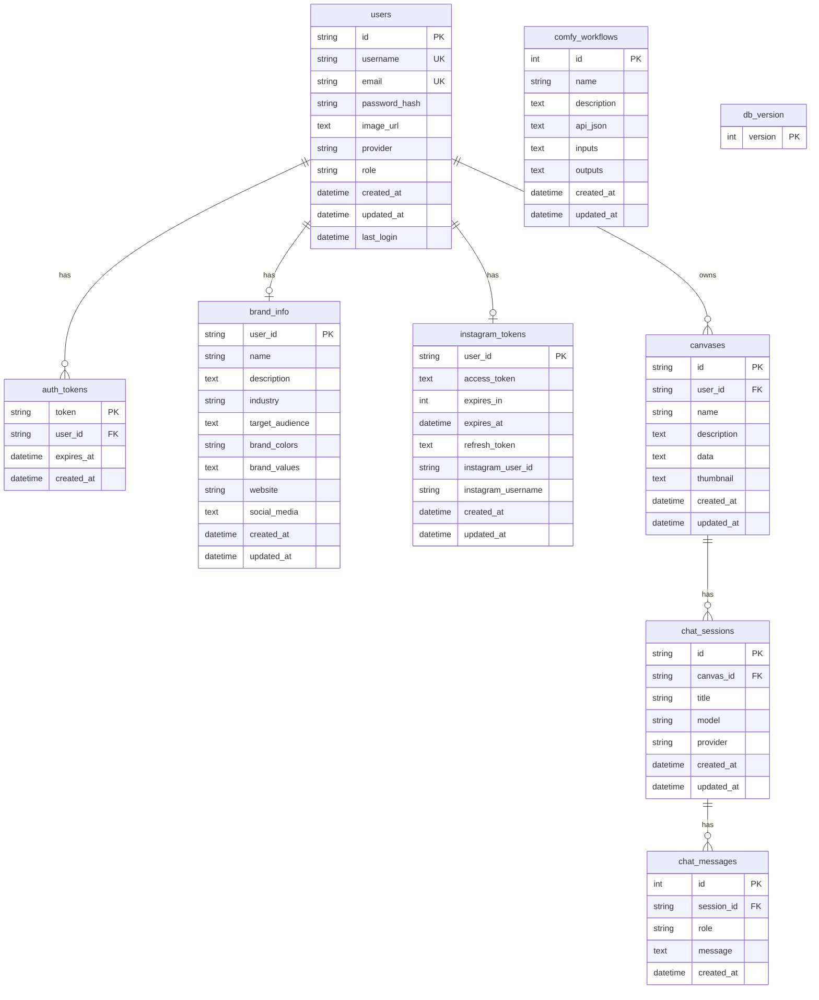

# Database Schema

> PostgreSQL 데이터베이스 테이블 구조

## ER Diagram

---

## Tables

### users
사용자 정보를 저장합니다.

| Column | Type | Constraints | Description |
|--------|------|-------------|-------------|
| id | VARCHAR(36) | PK | 사용자 고유 ID |
| username | VARCHAR(255) | UNIQUE, NOT NULL | 사용자명 |
| email | VARCHAR(255) | UNIQUE, NOT NULL | 이메일 |
| password_hash | VARCHAR(255) | | 비밀번호 해시 |
| image_url | TEXT | | 프로필 이미지 URL |
| provider | VARCHAR(50) | DEFAULT 'prism' | 인증 제공자 |
| role | VARCHAR(50) | DEFAULT 'user' | 사용자 역할 (user/admin) |
| created_at | TIMESTAMP | | 생성일시 |
| updated_at | TIMESTAMP | | 수정일시 |
| last_login | TIMESTAMP | | 마지막 로그인 |

### auth_tokens
인증 토큰을 저장합니다.

| Column | Type | Constraints | Description |
|--------|------|-------------|-------------|
| token | VARCHAR(255) | PK | 토큰 값 |
| user_id | VARCHAR(36) | FK → users.id | 사용자 ID |
| expires_at | TIMESTAMP | NOT NULL | 만료일시 |
| created_at | TIMESTAMP | | 생성일시 |

### brand_info
사용자별 브랜드 정보를 저장합니다.

| Column | Type | Constraints | Description |
|--------|------|-------------|-------------|
| user_id | VARCHAR(36) | PK, FK → users.id | 사용자 ID |
| name | VARCHAR(255) | | 브랜드명 |
| description | TEXT | | 브랜드 설명 |
| industry | VARCHAR(255) | | 산업군 |
| target_audience | TEXT | | 타겟 고객층 |
| brand_colors | VARCHAR(255) | | 브랜드 컬러 |
| brand_values | TEXT | | 브랜드 가치 |
| website | VARCHAR(500) | | 웹사이트 |
| social_media | TEXT | | 소셜 미디어 정보 |
| created_at | TIMESTAMP | | 생성일시 |
| updated_at | TIMESTAMP | | 수정일시 |

### instagram_tokens
인스타그램 OAuth 토큰을 저장합니다.

| Column | Type | Constraints | Description |
|--------|------|-------------|-------------|
| user_id | VARCHAR(36) | PK, FK → users.id | 사용자 ID |
| access_token | TEXT | NOT NULL | 액세스 토큰 |
| expires_in | INTEGER | | 만료 시간 (초) |
| expires_at | TIMESTAMP | | 만료일시 |
| refresh_token | TEXT | | 리프레시 토큰 |
| instagram_user_id | VARCHAR(100) | | 인스타그램 사용자 ID |
| instagram_username | VARCHAR(255) | | 인스타그램 사용자명 |
| created_at | TIMESTAMP | | 생성일시 |
| updated_at | TIMESTAMP | | 수정일시 |

### canvases
캔버스 정보를 저장합니다.

| Column | Type | Constraints | Description |
|--------|------|-------------|-------------|
| id | VARCHAR(36) | PK | 캔버스 ID |
| user_id | VARCHAR(36) | FK → users.id | 소유자 사용자 ID |
| name | VARCHAR(255) | NOT NULL | 캔버스 이름 |
| description | TEXT | | 설명 |
| data | TEXT | | 캔버스 데이터 (JSON) |
| thumbnail | TEXT | | 썸네일 URL |
| created_at | TIMESTAMP | | 생성일시 |
| updated_at | TIMESTAMP | | 수정일시 |

### chat_sessions
채팅 세션을 저장합니다.

| Column | Type | Constraints | Description |
|--------|------|-------------|-------------|
| id | VARCHAR(36) | PK | 세션 ID |
| canvas_id | VARCHAR(36) | FK → canvases.id | 캔버스 ID |
| title | VARCHAR(255) | | 세션 제목 |
| model | VARCHAR(100) | | 사용 모델 |
| provider | VARCHAR(50) | | AI 제공자 |
| created_at | TIMESTAMP | | 생성일시 |
| updated_at | TIMESTAMP | | 수정일시 |

### chat_messages
채팅 메시지를 저장합니다.

| Column | Type | Constraints | Description |
|--------|------|-------------|-------------|
| id | SERIAL | PK | 메시지 ID |
| session_id | VARCHAR(36) | FK → chat_sessions.id | 세션 ID |
| role | VARCHAR(50) | NOT NULL | 역할 (user/assistant) |
| message | TEXT | | 메시지 내용 (JSON) |
| created_at | TIMESTAMP | | 생성일시 |

### comfy_workflows
ComfyUI 워크플로우를 저장합니다.

| Column | Type | Constraints | Description |
|--------|------|-------------|-------------|
| id | SERIAL | PK | 워크플로우 ID |
| name | VARCHAR(255) | NOT NULL | 워크플로우 이름 |
| description | TEXT | | 설명 |
| api_json | TEXT | | API JSON 데이터 |
| inputs | TEXT | | 입력 정의 (JSON) |
| outputs | TEXT | | 출력 정의 (JSON) |
| created_at | TIMESTAMP | | 생성일시 |
| updated_at | TIMESTAMP | | 수정일시 |

### db_version
데이터베이스 버전 추적용 테이블입니다.

| Column | Type | Constraints | Description |
|--------|------|-------------|-------------|
| version | INTEGER | PK | 버전 번호 |

---

## Relationships

| Parent | Child | Type | Description |
|--------|-------|------|-------------|
| users | auth_tokens | 1:N | 사용자별 인증 토큰들 |
| users | brand_info | 1:1 | 사용자별 브랜드 정보 |
| users | instagram_tokens | 1:1 | 사용자별 인스타그램 연동 |
| users | canvases | 1:N | 사용자별 캔버스들 |
| canvases | chat_sessions | 1:N | 캔버스별 채팅 세션들 |
| chat_sessions | chat_messages | 1:N | 세션별 메시지들 |

---

## Indexes

| Table | Index Name | Columns |
|-------|------------|---------|
| auth_tokens | idx_auth_tokens_user_id | user_id |
| canvases | idx_canvases_user_id | user_id |
| chat_sessions | idx_chat_sessions_canvas_id | canvas_id |
| chat_messages | idx_chat_messages_session_id | session_id |

---

## Notes

- 모든 FK는 `ON DELETE CASCADE` 설정되어 부모 삭제 시 자식도 함께 삭제됩니다.
- `data`, `message`, `api_json`, `inputs`, `outputs` 컬럼은 JSON을 TEXT로 저장합니다.
- `created_at`은 자동으로 현재 시간이 설정됩니다.
- `updated_at`은 레코드 수정 시 자동으로 갱신됩니다.

